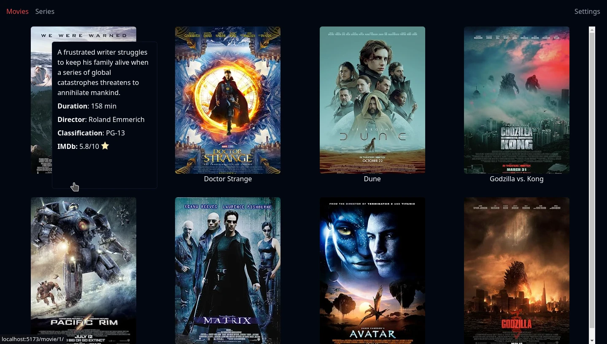

# Orus media server



## Development Environment Setup

To prepare the development environment for Orus media server, please ensure that you have the following software installed:

- Node.js 18 or higher
- Golang 1.17 or later

Once you have the required software installed, follow these steps to install the necessary dependencies and data:

1. Clone the repository:

    ```bash
    git clone https://github.com/AntonyChR/orus-media-server
    ```

2. Navigate to the project directory:

    ```bash
    cd orus-media-server
    ```

3. Execute the following command to prepare the necessary dependencies and data:

    ```bash
    make prepare
    ```

4. In the generated "config.toml" file, replace the "API_KEY" field with the key obtained from: https://www.omdbapi.com/apikey.aspx

    ```toml
    PORT = ":3002"
    API_KEY = "here your api key"
    DB_PATH = "./database.db"
    MEDIA_DIR = "./media"
    SUBTITLE_DIR = "./subtitles"
    ```

5. To start the project, run the following command in the root directory of the project:

    ```bash
    go run main.go
    ```

6. Then, navigate to the "./gui" directory and run the following command to start the frontend:

    ```bash
    npm run dev
    ```


This will set up the development environment for Orus media server and install all the required dependencies and data.
