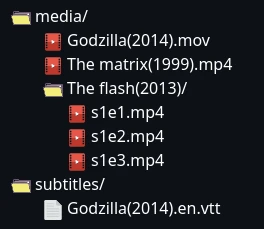

<div align="center">
 

# Orus media server

Media server with a simple and intuitive interface
</div>


[OMDB](https://www.omdbapi.com/) is used to obtain the information

## Setup

1. Get the api key from https://www.omdbapi.com/apikey.aspx
2. run the binary application (get it from [releases](https://github.com/AntonyChR/orus-media-server/releases))

3. On the first run the "media/" and "subtitles/" folders will be generated where you need to organize the video files, you can change them by editing the "config.toml" file.
    ```bash
    # Generated files
    config.toml
    database.db
    media/
    subtitles/
    ```
5. Open http://localhost:3002/config in your browser and set the API key or change the "API_KEY" value in the generated "config.toml" file in the same directory as the binary.
    ```toml
    # config.toml
    PORT = ":3002"
    API_KEY = "here your api key"
    DB_PATH = "./database.db"
    MEDIA_DIR = "./media"
    SUBTITLE_DIR = "./subtitles"
    ```
6. The organization of video files should have the following structure:

    

    Name formats:
    * Movie file: "movie name (year).ext"
    * TV series folder: "series name (year)/"
    * TV series episode: "sXeY.ext"
    * Subtitles: "movie name (year).lang.vtt"

## Development Environment Setup

To prepare the development environment:

- Node.js >= 18 
- Go >= 1.20 

1. Navigate to the project directory and execute the following command to prepare the necessary dependencies and create fake data:

    ```bash
    make prepare
    ```

2. In the generated "config.toml" file, replace the "API_KEY" (At the moment only the OMDB service is available) field with the key obtained from: https://www.omdbapi.com/apikey.aspx

    ```toml
    # config.toml
    PORT = ":3002"
    API_KEY = "here your api key"
    DB_PATH = "./database.db"
    MEDIA_DIR = "./media"
    SUBTITLE_DIR = "./subtitles"
    ```

3. To start the project, run the following command in the root directory of the project:

    ```bash
    go run main.go
    ```

4. Then, navigate to the "./gui" directory and run the following command to start the frontend:

    ```bash
    npm run dev
    ```
5. Open http://localhost:5173/config in your browser and click "Reset Database".


This will set up the development environment for Orus media server and install all the required dependencies and create fake data.

## Build and run the application

Run the following command to compile 

```bash
make build
```
This will generate the following files in ```dist/``` directory:

```sh
app #binary aplication
```

When you first run the application binary, it will generate the "config.toml" file with the default configuration.

__Continue with the first section: [Setup](https://github.com/AntonyChR/orus-media-server#Setup)__
